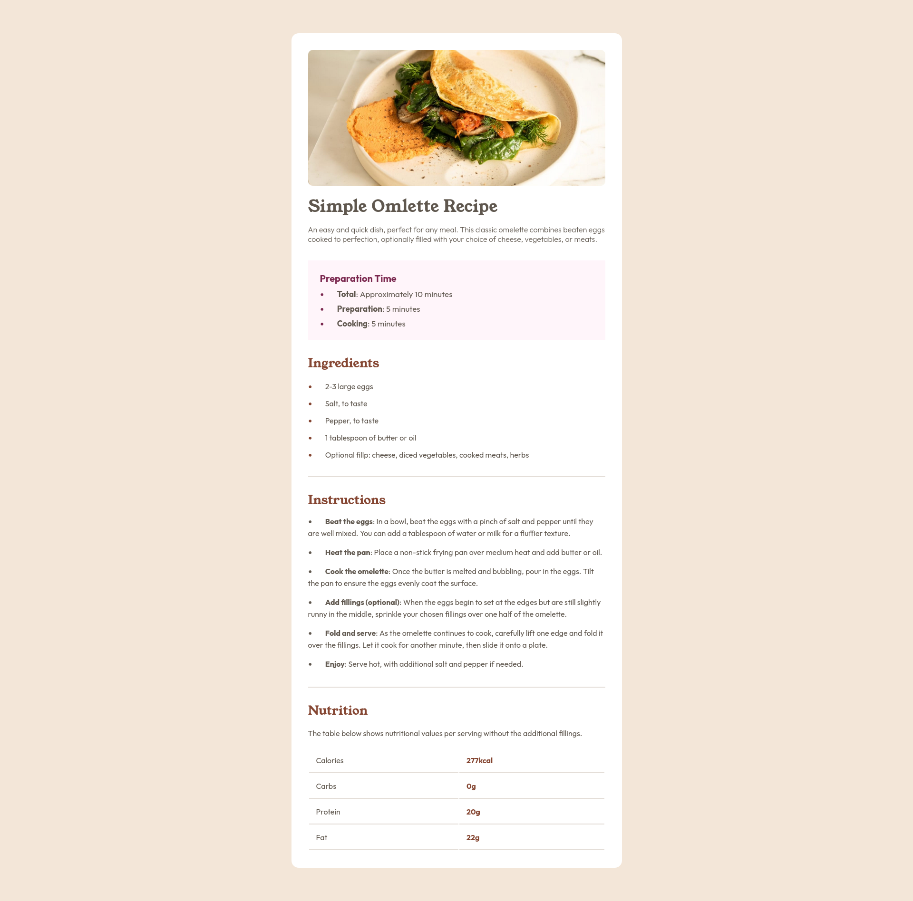

# Frontend Mentor - Recipe page solution

This is a solution to the [Recipe page challenge on Frontend Mentor](https://www.frontendmentor.io/challenges/recipe-page-KiTsR8QQKm). Frontend Mentor challenges help you improve your coding skills by building realistic projects. 

## Table of contents

- [Overview](#overview)
  - [The challenge](#the-challenge)
  - [Screenshot](#screenshot)
  - [Links](#links)
- [Author](#author)

## Overview

### Screenshot

### Links

- Solution URL: [Add solution URL here](https://your-solution-url.com)
- Live Site URL: [Click here](https://sibi404.github.io/frontendmentor-recipe-page/)

## Author

- Frontend Mentor - [sibi404](https://www.frontendmentor.io/profile/sibi404)
- LinkedIn - [SIBI K](https://www.linkedin.com/in/sibi-k-6a6848211/)

